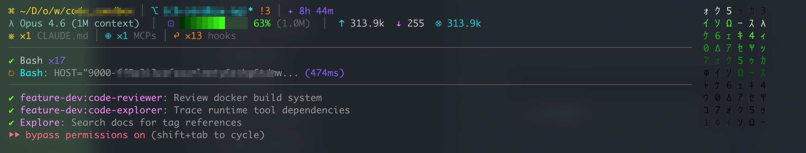

<div align="center">



# pi-shannon-statusline

**Cyberpunk terminal HUD for [Pi](https://github.com/earendil-works/pi-coding-agent)**

Ported from [shannon-statusline](https://github.com/RealAlexandreAI/shannon-statusline) (Claude Code).

</div>

---

## What you get

A live HUD rendered below every Pi response:

```
⌘ ~/D/project  │  ⎇ main* ↑2 !3 +1  │  ✦ 12m
↑ deepseek / deepseek-v4-pro  │  ⊡ ████████░░░░ 65% (200k)  │  ↑ 36k
※ ×3 AGENTS.md  │  ⊕ ×4 MCPs  │  ×5 skills
─────────────────────────────────────────────────────────────
✔ read ×12  │  ✔ edit ×7  │  ✔ bash ×4
↻ bash: src/index.ts (3s)
─────────────────────────────────────────────────────────────
↻ agent (3s)  │  ✔ agent ×2
```

Matrix-style katakana rain on the left (toggleable). Two visual styles. No Nerd Font needed.

---

## Install

```bash
git clone https://github.com/Slahser/pi-shannon-statusline.git ~/Desktop/pi-shannon-statusline
cd ~/Desktop/pi-shannon-statusline
pi install .
```

Or install as a Pi extension (once published):

```bash
pi install git:github.com/Slahser/pi-shannon-statusline
```

---

## Commands

```
/shannon-statusline                 # Show help
/shannon-statusline style cyberpunk # Monokai Pro palette + matrix rain (default)
/shannon-statusline style powerline # Bright separator bars, muted accents
/shannon-statusline rain on         # Enable matrix rain
/shannon-statusline rain off        # Disable matrix rain
```

Config persisted to `~/.pi/shannon-statusline.json`.

---

## Features

| Section | Content |
|---|---|
| **Project + Git** | CWD (fish-style abbreviation), branch, dirty, ahead/behind, modified/added/deleted/untracked |
| **Model + Context** | Provider / model name, context bar with percentage, token count |
| **Config counts** | AGENTS.md ×N, rules ×N, MCPs ×N, skills ×N |
| **Tool activity** | Completed tool counts (read/edit/write/bash/grep/find/ls), running tools with elapsed time |
| **Agent activity** | Running agent timer, completed agent count (Pi core events) |
| **Matrix rain** | 6-column animated katakana rain (toggleable via `/shannon-statusline rain on|off`) |
| **2 styles** | `cyberpunk` (Monokai Pro), `powerline` (bright separators) |

## Pi-native advantages

- **Live context API** — reads `getContextUsage()` directly, no stdin parsing
- **Widget rendering** — uses `ctx.ui.setWidget()` below the editor
- **Session-aware** — resets on `/new`, `/resume`, `/fork`
- **Model auto-detection** — updates on `model_select` event
- **Tool/agent tracking** — hooks `tool_call`, `tool_result`, `agent_start`, `agent_end`
- **Zero config** — works out of the box, style/rain toggleable via slash command

## Testing

```bash
node --test src/__tests__/hud.test.ts
```

Covers: tool count rendering, agent activity display, separator formatting, formatters.

## License

MIT — based on [shannon-statusline](https://github.com/RealAlexandreAI/shannon-statusline) (MIT)
